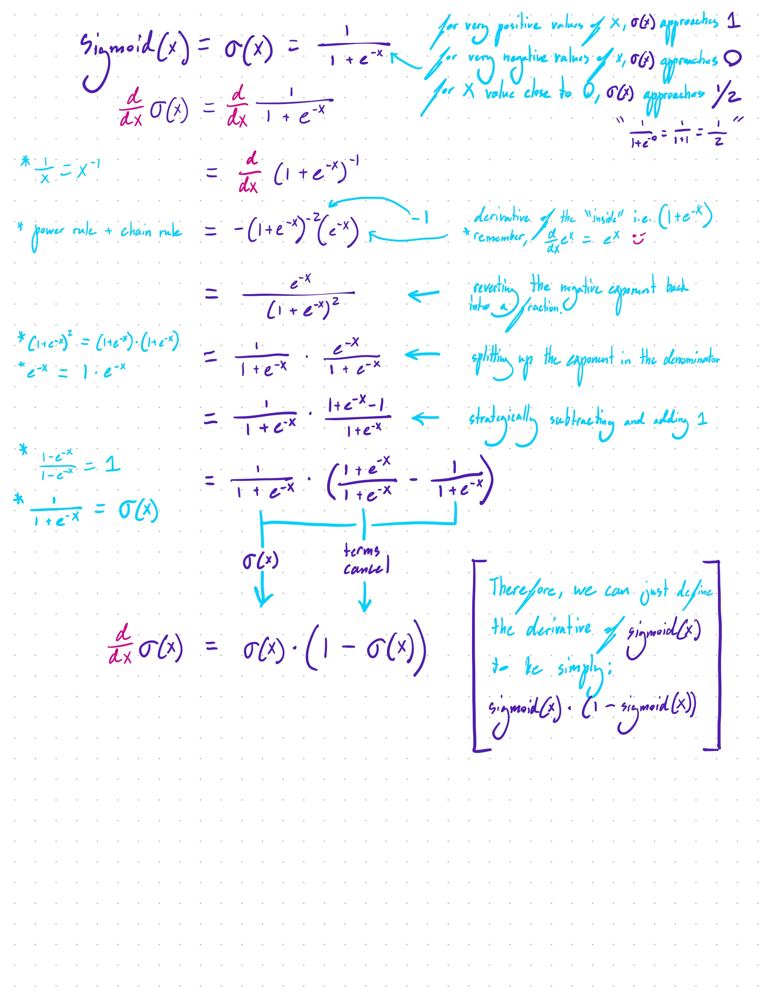

# cscratchnn
A simple, proof of concept neural network in C, mainly for strengthening my mathematical intuition. 

Having just taken a digital logic circuit design class (and falling in love with it), I wanted to test the classic XOR function, known for its very simple nonlinear structure. When graphed, you'll see that it isn't linearly separable.


I'd used numpy, keras, and pytorch to implement the simple structure of basic feedforward neural networks. I wanted to get even closer to the boilerplate and utilize C's speed. I want to learn how to use it for more complicated networks going forward. 

## How To Run

This one is simple. No packages or libraries to pip install. Just create a directory to store the file, and name your file something like `neuralnetwork.c`. Paste in my code.

To compile, cd into the directory, and: 

```bash
gcc -o neuralnetwork neuralnetwork.c -lm
```

To run: 

```bash
./neuralnetwork
```

## Your results should look something like this:


the outputs that come from either 0 and 0 or 1 and 1 are closer to 0, whereas the inputs 1 and 0 or 0 and 1 produce results closer to 1. It's working. 

---

Although the code is fully commented for learning purposes, I would like to clarify a few things. First, is that this version only uses sigmoid activations, 2 hidden neurons, and rank 1 tensors (arrays) for simplicity's sake. Hopefully, cscratchnnV2 will improve upon this. Next, is that you may notice the following:

```c
// Derivative of sigmoid function
// Used in backpropagation to calculate gradients
// This represents the slope of the sigmoid function at a given point
double sigmoid_derivative(double x) {
    return x * (1 - x); // Simplified derivative based on the sigmoid output
    // This simplification works because we're passing in the sigmoid output, not the input
}
```

So, why can we say that the derivative of sigmoid(x) is equal to (1 - sigmoid(x))?
`d/dx s(x) = s(x) * (1 - s(x))`

I have provided a full derivation of this, with hand-drawn comments that I hope are legible. Those strange curvy letters that I use are capital F's:


